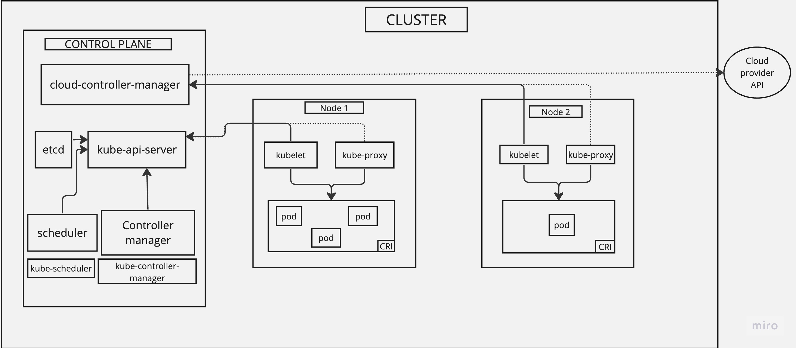

# Kubernetes Architecture

## Cluster Architecture

### Diagram

### Nodes

- Kubernetes runs your workload by placing containers into Pods to run on nodes. Each node is managed by the control plane and contains the services necessary to run Pods.
- The components on a node include the kubelet, a container runtime and the kube-proxy.

#### Management

- The kubelet on a node self-registers to the control plane
- You (or another human user) manually add a Node object.

After you create a Node object, or the kubelet on a node self-registers, the control plane checks whether the new Node object is valid.

Kubernetes creates a Node object internally (representation). Kubernetes checks that a kubelet has registered to the API server that matches the """metadata.name""" field of the Node. If the node is healthy, then it is eligible to run a Pod. Otherwise, that node is ignored for any cluster activity until it becomes healthy.

### Node to Control Plane

- Has a "hub-and-spoke" API pattern. All API usage from nodes terminates at the API server. None of the other control plane components are designed to expose remote services.
- Nodes should be provisioned with the public root certificate for the cluster such that they can connect securely to the API server along with valid client credentials.
- Pods that wish to connect to the API server can do so securely by leveraging a service account so that Kubernetes will automatically inject the public root certificate and a valid bearer token into the pod when it is instantiated.

#### Control plane to node

##### API server to kubelet

- Fetching logs for pods
- Attaching (usually through """kubectl""") to running pods
- Providing the kubelet's port-forwarding functionality

These connections terminate at the kubelet's HTTPS endpoint. 

#### API server to nodes, pods and services

The connections from the API server to a node, pod, or service default to plain HTTP connections and are therefore neither authenticated nor encrypted.

##### SSH tunnels

Kubernetes supports SSH tunnels to protect the control plane to nodes communication paths.

##### Konnectivity Service

As a replacement to the SSH tunnels, the Konnectivity service provides TCP level proxy for the control plane to cluster communication.

### Controllers

#### Controller Pattern

- A controller tracks at least one kubernetes resource type.
- Objects have a spec field that represents the desired state.
- They might carry the action out itself; more commonly, in Kubernetes, a controller will send messages to the API server that have useful side effects.

#### Control via API server

- Built-in controllers manage state by interacting with the cluster API server.
- Jıb is a Kubernetes resource that runs a Pod, or perhaps several Pods, to carry out a task and then stop.
- When the Job controller sees a new task it makes sure that, somewhere in your cluster, the kubelets on a set of Nodes are running the right number of Pods to get the work done.
- Job controller does not  run any Pods or containers itself. It only tells the API server to create or remove pods.
- Controllers also update the objects that configure them.

#### Direct control

- Controllers that interact with external state find their desired state from the API server, then communicate directly with an external system to bring the current state closer in line

#### Desired vs current state

- Your cluster could be changing at any point as work happens and control loops automatically fix failures.
- As long as the controllers for your cluster are running and able to make useful changes, it doesn't matter if the overall state is stable or not.

#### Design

- They generally use one kind of resources at its desired state, and has a different kind of resource that it manages to make that desired state happen.
- It's useful to have simple controllers rather than one, monolithic set of control loops that are interlinked. Controllers can fail, so Kubernetes is designed to allow for that.

## Leases

- Used for system-critical capabilities such as node heartbeats and component-level leader election.

### Node heartbeats

- Kubernetes uses the Lease API to communicate kubelet node heartbeats to the Kubernetes API server. 
- For every """Node""", there is a """Lease""" object with a matching name in the """kube-node-release""" namespace. Under the hood, every kubelet heartbeat is an update request to this """Lease""" object, updating the 
"""spec.renewTime""" field for the Lease. The Kubernetes control plane uses the time stamp of this field to determine the availability of this """Node""".

### Leader election

- Kubernetes also uses Leases to ensure only one instance of a component is running ay any given time. This is used by control plane components like """kube-controller-manager""" and """kube-scheduler""" in HA configurations, where only one instance of the component should be actively running while the other instances are on stand-by.

### API server identity 

- (Starts in Kubernetes v1.26), each """kube-apiserver""" uses the Lease API to publish its identity to the rest of the system. While not particularly useful on its own, this provides a mechanism for clients to discover how many instances of """kube-apiserver""" are operating the Kubernetes control plane. Existence of kube-apiserver leases enables future capabilities that may require coordination between each kube-apiserver.
- Expired leases from kube-apiservers that no longer exist are garbage collected by new kube-apiservers after 1 hour.

### Workloads

- Your own workload can define its own use of leases.
- It's a good practice to define a name for the Lease that is obviously linked to the product or component.
- If a cluster operator or another end user could deploy multiple instances of a component, select a name prefix and pick a mechanism to avoid name collisions for the Leases.

## Cloud Controller Manager

- Embeds cloud-specific control logic.
- Lets you link your cluster into your cloud provider's API, and separates out the components that interact with that cloud platform from components that only interact with your cluster.
- By decoupling the interoperability logic between Kubernetes and the underlying cloud infrastructure, the cloud-controller-manager component enables cloud providers to release features at a different pace compared to the main Kubernetes project.

### Design

- The cloud controller manager runs in the control plane as a replicated set of processes. Each cloud controller-manager implements multiple controllers in a single process

### Node controller

- Update a Node object with the corresponding server's unique identifier obtained from the cloud provider API.
- Annotating and labelling the Node object with cloud-specific information.
- Obtain the node's hostname and network addresses.
- Verifying the node's health. In case a node becomes unresponsive, this controller checks with your cloud provider's API to see if the server has been deactivated/deleted/terminated. If the node has been deleted from the cloud, the controller deletes the Node object from your Kubernetes cluster.

### Route controller

- Responsible for configuring routes in the cloud appropriately so that containers on different nodes in your Kubernetes cluster can communicate with each other.
- Depending on the cloud provider, the route controller might also allocate blocks of IP addresses for the pod network.

### Service controller

- Services integrate with cloud infrastructure components. 
- Interacts with your cloud provider's APIs to set up load balancers and other infrastructure components when you declare a Service resource that requires them

### Authorization

#### Node controller

- Only works with Node objects. Requires full access to read and modify Node objects.

"""v1/Node""":

    - get
    - list
    - create
    - update
    - patch
    - watch
    - delete

#### Route Controller

- Listens to node object creation and configures routes appropriately. Requires Get access to Node objects.

"""v1/Node""":

    - get

#### Service Controller

- Watches for Service object create, update and delete events and then configures Endpoints for those Services appropriately.
- Requires list and watch access to access services.
- Requires patch and update access to update services

"""v1/Service"""

    - list
    - get
    - watch
    - patch
    - patch
    - update

#### Others

- Requires access to create Event objects, and to ensure secure operation, it requires access to create ServiceAccounts.

"""v1/Event"""

    - create
    - patch
    - update

"""v1/ServiceAccount"""

    - create

### cgroup v2

- Next version of the Linux """cgroup""".
- Provides a unified control system with enhanced resource management capabilities.

Improvements over v1:

    - Single unified hierarchy design in API
    - Safer sub-tree delegation to containers
    - Newer features like Pressure Stall Information
    - Enhanced resource allocation management and isolation across multiple resources
      - Unified accounting for different types of memory allocations (network memory, kernel memory, etc)
      - Accounting for non-immediate resource changes such as page cache write backs

Some Kubernetes features exclusively use cgroup v2 for enhanced resource management and isolation.

### Container Runtime Interface (CRI)

- Plugin interface which enables the kubelet to use a wide variety of container runtimes, without having a need to recompile the cluster components.
- Need a working container runtime on each Node in your cluster, so that the kubelet can launch Pods and their containers.
- Main protocol for the communication between the kubelet and Container Runtime.
- Defines the main gRPC protocol for the communication between the node components kubelet and container runtime.

#### The API

- Kubelet acts as a client when connecting to the container runtime via gRPC. 
- Runtime and image service endpoints have to be available in the container runtime, which can be configured separately within the kubelet by using the """--image-service-endpoint""".

### Garbage Collection

#### Owners and Dependents

- Owner reference tell the control plane which objects are dependent on others.
- Kubernetes uses owner references to give the control plane, and other API clients, the opportunity to clean up related resources before deleting an object.

#### Cascading Deletion

- Kubernetes checks for and deletes objects that no longer have owner references.
- When you delete an object, you can control whether Kubernetes deletes the object's dependents automatically, in a process called cascading deletion.

## References

- https://kubernetes.io/docs/concepts/architecture/